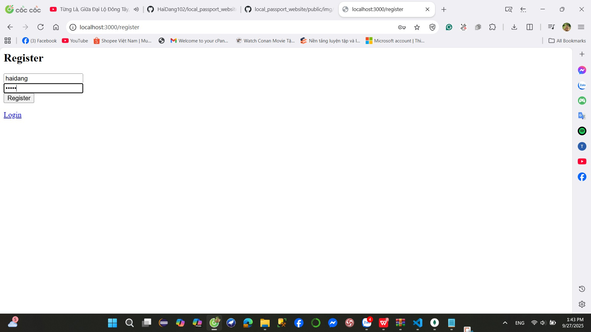

# Authentication Labs Report

---
## **1. local_passport_website**

A website using Passport.js Local Strategy + MongoDB + EJS templates.

### **a. Run server**
```bash
node app.js
```
Server runs at: `http://localhost:3000`


### **b. Register**
- URL: `http://localhost:3000/register`
- Fill form with username & password.
- User is saved to MongoDB with hashed password.


### **c. Login**
- URL: `http://localhost:3000/login`
- Enter credentials → if correct → redirect to profile.

### **d. Profile**
- URL: `http://localhost:3000/profile`
- Shows:
  ```
  Welcome <username>
  Logout
  ```
- If not authenticated → redirected to login.


### **e. Logout**
- Click Logout link → session destroyed → redirected to login.

---

## **Notes (common for all labs)**
- **Basic Auth**: stateless, credentials sent in every request.
- **Cookie Auth**: cookie token stored in DB + browser.
- **Session Auth**: session stored in MongoDB, client only holds `connect.sid`.
- **Passport Local**: higher-level library, integrates with sessions, simplifies login & logout flows.
- Passwords always stored as **bcrypt hash** for security.
